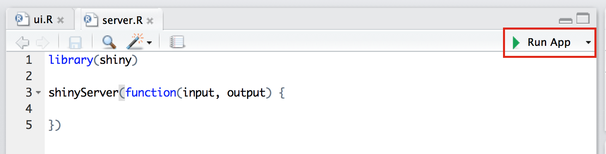
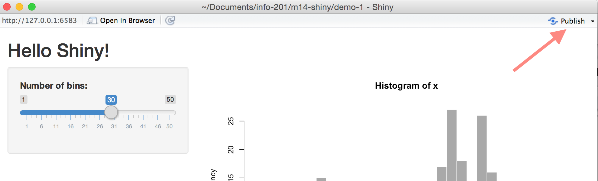

# Module 14: Shiny

## Overview
In this (brief) learning module, we introduce the Shiny framework for building interactive applications in R. Shiny provides a structure for communicating between a user-interface (i.e., a web-browser) and an R session. This not only enables developers to create interactive graphics, but provides a way for users to interact directly with a R session (without writing any code!).

<!-- START doctoc generated TOC please keep comment here to allow auto update -->
<!-- DON'T EDIT THIS SECTION, INSTEAD RE-RUN doctoc TO UPDATE -->
**Contents**

- [Resources](#resources)
- [Using Multiple R Files](#using-multiple-r-files)
- [Shiny](#shiny)
  - [Application Architecture](#application-architecture)
  - [User Interface (ui.R)](#user-interface-uir)
  - [Server code (server.r)](#server-code-serverr)
- [Publishing ShinyApps](#publishing-shinyapps)

<!-- END doctoc generated TOC please keep comment here to allow auto update -->

## Resources
- [Shiny Website](http://shiny.rstudio.com/)
- [Shiny Basics](http://shiny.rstudio.com/articles/basics.html)
- [Shiny Tutorial](http://shiny.rstudio.com/tutorial/)
- [Shiny Widgets](http://shiny.rstudio.com/gallery/widget-gallery.html)
- [shinyapps.io](https://www.shinyapps.io)
- [ShinyApps User Guide](http://docs.rstudio.com/shinyapps.io/index.html)

## Using Multiple R Files
As projects begin to scale in size and complexity, it's common to use multiple R scripts to perform your analysis. In the same way that we can use the `library` function to load R code into our session, we can use the `source` function to _load our own R scripts_. For example, imagine you have a file in which you write an R function for building a map:

```r
# buildMap.R

BuildMap <- function(...) {
    # build a map using the data passed into this function

    # Return your map
}
```

You could then leverage this function in another R script by using the `source` function to load your file:

```r
# analysis.R file: using other file's function, build a map

# Make sure your directory is properly set
setwd(...)

# Use the source function to load your file
source('./scripts/buildMap.R')

# Pass data to your function that you can now use
df <- read.csv('some/csv/file')
buildMap(df)
```

To practice breaking your code into multiple files, see [exercise-1](exercise-1).

## Shiny
Shiny is a **web application framework for R**. As opposed to a simple (static) web page, a _web application_ supports more sophisticated interactions, and often connects multiple programming environments (i.e., passing information between multiple machines).

### Application Architecture
In order to use Shiny, you'll need to have a strong understanding of how a Shiny App is organized. [This article](http://shiny.rstudio.com/articles/basics.html) outlines it pretty clearly. In short, you'll have two scripts: one to describe the **user interface** (`ui.R`), and another to describe the code to execute in R (`server.R`).

### User Interface (ui.R)
The user interface of your application (i.e., how your app will be displayed to your user in a web browser) is described by your `ui.R` file. Similarly to using RMarkdown, it can render R content such as text or graphics. However, it also allows you to create **widgets**, which are interactive controls that affect your application. Here is a simple example of writing out a user-interface (for more widgets, see [here](http://shiny.rstudio.com/gallery/widget-gallery.html)):

```r
# From http://shiny.rstudio.com/articles/basics.html
library(shiny)

# Define UI for application that draws a histogram
shinyUI(fluidPage(

  # Application title
  titlePanel("Hello Shiny!"),

  # Sidebar with a slider input for the number of bins
  sidebarLayout(
    sidebarPanel(
      sliderInput("bins",
                  "Number of bins:",
                  min = 1,
                  max = 50,
                  value = 30)
    ),

    # Show a plot of the generated distribution
    mainPanel(
      plotOutput("distPlot")
    )
  )
))
```

The above code defines a user-interface's layout using _panels_, or sections of a page. The segment above would render this UI:


If you dissect the code, you can start to see how each element is rendered in the UI. However, it doesn't make clear where the element `"distPlot"` is coming from. That's the other half of our project, in `server.R`.

### Server code (server.r)
Your user interface (`ui.R`) is populated with information from an R session (which we'll think of as the _server_ for our application). The Shiny architecture allows you to pass information back and forth between the user-interface and the server. Here is the corresponding `server.R` code for the UI above:

```r
# From: http://shiny.rstudio.com/articles/basics.html
library(shiny)

# Define server logic required to draw a histogram
shinyServer(function(input, output) {

  # Expression that generates a histogram. The expression is
  # wrapped in a call to renderPlot to indicate that:
  #
  #  1) It is "reactive" and therefore should be automatically
  #     re-executed when inputs change
  #  2) Its output type is a plot

  output$distPlot <- renderPlot({
    x    <- faithful[, 2]  # Old Faithful Geyser data
    bins <- seq(min(x), max(x), length.out = input$bins + 1)

    # draw the histogram with the specified number of bins
    hist(x, breaks = bins, col = 'darkgray', border = 'white')
  })

})
```

Note, the `distPlot` is stored as part of the server's _output_ (`output$distPlot`). It is then **accessible in the UI**, and can be rendered using the `plotOutput` function.

Similarly, you should note that the UI has a `sliderInput` called **`bins`**. We can then **reference the UI information** in our `server.R` file by saying `input$bins` (i.e., `bins` is stored as part of the `input` that the _server_ receives).

To actually run your Shiny app, click on the **Run App** button in R Studio:



To see these scripts in action, see [demo-1](demo-1), or practice with [exercise-2](exercise-2).

## Publishing ShinyApps
Sharing a ShinyApp with the world is a bit more involved than simply pushing your code to GitHub(though still quite painless). We can just use GitHub because, in addition to needed a web host, we need a session of R running that the UI can connect to. In this class, we'll introduce [shinyapps.io](https://www.shinyapps.io).

You'll need to create an account on [shinyapps.io](https://www.shinyapps.io), then you can publish your apps using the **publish** button:



You should then be able to access your app at `https://USERNAME.shinyapps.io/PROJECT-NAME/`. For more information and troubleshooting, see the [documentation](http://docs.rstudio.com/shinyapps.io/index.html).
