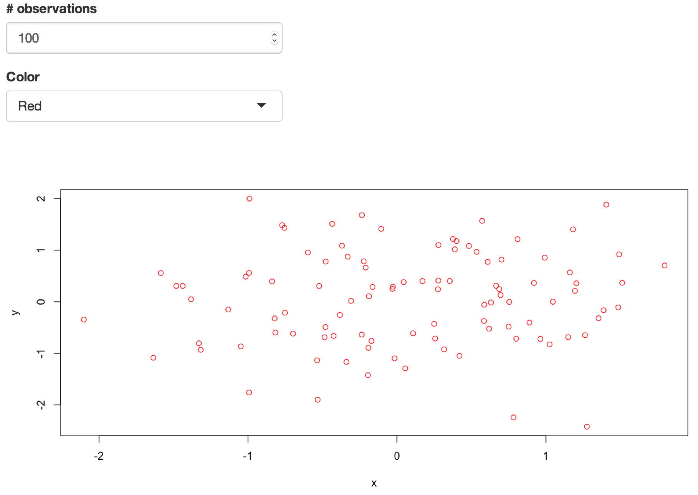

# Exercise-2
In this exercise, you'll build a simple Shiny application that can communicate between a server and a user-interface. The final product will be a scatterplot in which you can select the number of observations and the color (using shiny widgets):

As in previous exercises, you should fork and clone this repository, follow the instructions in the `ui.R` and `server.R` files, then `add` and `commit` your changes so that you can `push` them back up to GitHub.
